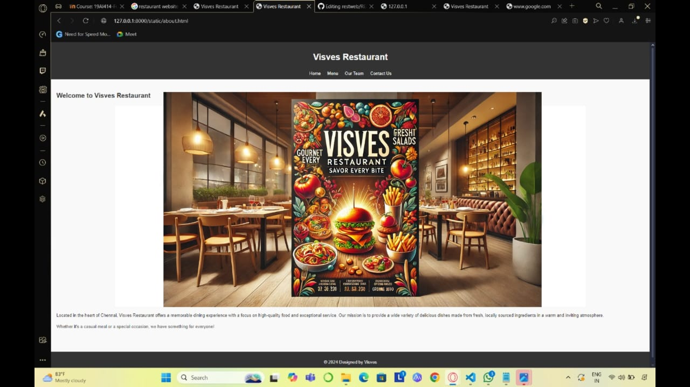

# Ex.07 Restaurant Website
## Date:
11.12.2024

## AIM:
To develop a static Restaurant website to display the food items and services provided by them.

## DESIGN STEPS:

### Step 1:
Requirement collection.

### Step 2:
Creating the layout using HTML and CSS.

### Step 3:
Updating the sample content.

### Step 4:
Choose the appropriate style and color scheme.

### Step 5:
Validate the layout in various browsers.

### Step 6:
Validate the HTML code.

### Step 7:
Publish the website in the given URL.

## PROGRAM:
```
index.html
<!DOCTYPE html>
<html lang="en">
<head>
  <meta charset="UTF-8">
  <meta name="viewport" content="width=device-width, initial-scale=1.0">
  <title>Our Restaurant</title>
  <link rel="stylesheet" href="style.css">
</head>
<body>
  <header>
    <h1>VISVES RESTAURANT</h1>
    <nav>
      <a href="#about">About Us</a>
      <a href="#menu">Menu</a>
      <a href="#team">Team</a>
      <a href="#contact">Contact Us</a>
    </nav>
  </header>

  <section id="logo-details">
    <div class="logo-container">
      
    </div>
    <div class="restaurant-details">
      <h2>Welcome to Visves Restaurant</h2>
      <p>
        Located in the heart of Chennai, Visves Restaurant offers a memorable dining experience with a focus on high-quality food and exceptional service. Our mission is to provide a wide variety of delicious dishes made from fresh, locally sourced ingredients in a warm and inviting atmosphere. Whether it's a casual meal or a special occasion, we have something for everyone!
      </p>
      <p>
        Come visit us and enjoy delightful meals, friendly service, and an atmosphere that feels like home.
      </p>
    </div>
  </section>
  
  <main>
    <!-- About Us Section -->
    <section id="about">
        <h2>About Us</h2>
        
        <p>
          Welcome to <strong>Visves Restaurant</strong>, where passion for food and love for service come together to create a truly unforgettable dining experience. Founded by Visves, an 18-year-old food enthusiast, our restaurant strives to offer both comfort and culinary delight for every guest who walks through our doors.
        </p>
        <p>
          At Visves Restaurant, we believe that food is more than just a meal – it's an experience. Our menu is carefully crafted to offer a blend of traditional favorites and innovative dishes, all made with the finest ingredients. Whether you're in the mood for a delicious pizza, a comforting bowl of pasta, or something new and exciting, our team is here to delight your taste buds.
        </p>
        <p>
          We are committed to providing not only mouthwatering dishes but also exceptional service in a warm and welcoming atmosphere. From the moment you enter, you'll be greeted by our friendly staff who are dedicated to making your dining experience perfect.
        </p>
        <p>
          Located in the heart of Chennai, we take pride in our local roots and the strong relationships we’ve built with local farmers and suppliers. We strive to use fresh, locally sourced ingredients, ensuring that every dish we serve is of the highest quality.
        </p>
        <p>
          Our mission is simple – to create a space where you can come together with family, friends, and loved ones to share delicious food and make lasting memories. Whether you're here for a special occasion, a casual meal, or simply to enjoy a drink, Visves Restaurant is your go-to destination for great food and hospitality.
        </p>
        <p>
          Thank you for choosing us! We look forward to serving you and ensuring that every meal is one you'll remember.
        </p>
      </section>
      

    <!-- Menu Section -->
    <section id="menu">
        <h2>Our Menu</h2>
        
        
        <div class="menu-list">
          <div class="menu-item">
            
            <p>Pizza</p>
          </div>
          <div class="menu-item">
            
            <p>Burger</p>
          </div>
          <div class="menu-item">
            
            <p>Pasta</p>
          </div>
          <div class="menu-item">
            
            <p>Salad</p>
          </div>
          <div class="menu-item">
            
            <p>Sushi</p>
          </div>
          <div class="menu-item">
            
            <p>Steak</p>
          </div>
          <div class="menu-item">
            
            <p>Fries</p>
          </div>
          <div class="menu-item">
            
            <p>Ice Cream</p>
          </div>
        </div>
      </section>

    <!-- Team Section -->
    <section id="team">
      <h2>Our Team</h2>
      <div class="team">
        <div class="member">
          
          <p>Visveswarran - Manager</p>
        </div>
        <div class="member">
          
          <p>Jane Smith - Chef</p>
        </div>
        <div class="member">
          
          <p>Sam Lee - Waiter</p>
        </div>
        <div class="member">
            
            <p>Steve Smith - Chef</p>
          </div>
          <div class="member">
            
            <p>William - Chef</p>
          </div>
      </div>
    </section>

    <!-- Contact Us Section -->
    <section id="contact">
      <h2>Contact Us</h2>
      
      <p>Address: 123 Food Street, Chennai, India</p>
      <p>Phone: +91 7558188817</p>
      <p>Email: revengeythmm123@gmail.com</p>
    </section>
  </main>

  <footer>
    <p>&copy; 2024 Designed by Visves</p>
  </footer>
</body>
</html>

menu.html

<!DOCTYPE html>
<html lang="en">
<head>
  <meta charset="UTF-8">
  <meta name="viewport" content="width=device-width, initial-scale=1.0">
  <title>Menu</title>
  <link rel="stylesheet" href="style.css">
</head>
<body>
  <header>
    <h1>Our Menu</h1>
    <nav>
      <a href="index.html">About Me</a>
      <a href="menu.html">Menu</a>
      <a href="admin.html">Administration</a>
      <a href="contact.html">Contact Us</a>
    </nav>
  </header>
  <main>
    
    <h2>Delicious Dishes</h2>
    <div class="menu-grid">
      <div class="menu-item" onclick="showDetails('Pizza', 'images/pizza.jpg')">
        
        <p>Pizza</p>
      </div>
      <div class="menu-item" onclick="showDetails('Burger', 'images/burger.jpg')">
        
        <p>Burger</p>
      </div>
      <div class="menu-item" onclick="showDetails('Pasta', 'images/pasta.jpg')">
        
        <p>Pasta</p>
      </div>
      <div class="menu-item" onclick="showDetails('Salad', 'images/salad.jpg')">
        
        <p>Salad</p>
      </div>
    </div>
    <div id="food-details" class="food-details">
      <!-- Food details will display dynamically here -->
    </div>
  </main>
  <footer>
    <p>&copy; 2024 Designed by Visves</p>
  </footer>
  <script>
    function showDetails(name, imgSrc) {
      const details = document.getElementById('food-details');
      details.innerHTML = `
        <h3>${name}</h3>
        
      `;
    }
  </script>
</body>
</html>

admin.html

<!-- admin.html -->
<!DOCTYPE html>
<html lang="en">
<head>
  <meta charset="UTF-8">
  <meta name="viewport" content="width=device-width, initial-scale=1.0">
  <title>About Me</title>
  <link rel="stylesheet" href="style.css">
</head>
<body>
  <header>
    <h1>About Me</h1>
    <nav>
      <a href="index.html">About Me</a>
      <a href="menu.html">Menu</a>
      <a href="admin.html">Administration</a>
      <a href="contact.html">Contact Us</a>
    </nav>
  </header>
  <main>
    <section class="about">
      <h2>About Me</h2>
      
      <p>Hello! I am Visves, an 18-year-old food enthusiast with a passion for creating vibrant dining experiences. Our restaurant aims to provide delicious meals with excellent service in a welcoming atmosphere. Whether you're here for a quick snack or a fine dining experience, we've got you covered. Come and explore our menu!</p>
    </section>
  </main>
  <footer>
    <p>&copy; 2024 Designed by Visves</p>
  </footer>
</body>
</html>


contact.html

<!DOCTYPE html>
<html lang="en">
<head>
  <meta charset="UTF-8">
  <meta name="viewport" content="width=device-width, initial-scale=1.0">
  <title>Contact Us</title>
  <link rel="stylesheet" href="style.css">
</head>
<body>
  <header>
    <h1>Contact Us</h1>
    <nav>
      <a href="index.html">About Me</a>
      <a href="menu.html">Menu</a>
      <a href="admin.html">Administration</a>
      <a href="contact.html">Contact Us</a>
    </nav>
  </header>
  <main>
    <h2>Get in Touch</h2>
    
    <p>Address: 123 Food Street, Chennai, India</p>
    <p>Phone: +91 9876543210</p>
    <p>Email: contact@restaurant.com</p>
  </main>
  <footer>
    <p>&copy; 2024 Designed by Visves</p>
  </footer>
</body>
</html>

style.css

#logo-details {
    text-align: center;
    padding: 40px 20px;
    background-color: #fff;
  }
  
  .logo-container {
    margin-bottom: 20px;
  }
  
  .restaurant-logo {
    width: 200px; /* Adjust size as needed */
    height: auto;
    border-radius: 10px;
    box-shadow: 0 4px 8px rgba(0, 0, 0, 0.1);
  }
  
  .restaurant-details h2 {
    font-size: 28px;
    margin-top: 20px;
    color: #333;
  }
  
  .restaurant-details p {
    font-size: 18px;
    color: #666;
    line-height: 1.6;
    max-width: 800px;
    margin: 10px auto;
  }
  body {
    font-family: Arial, sans-serif;
    margin: 0;
    padding: 0;
    line-height: 1.6;
    background-color: #f9f9f9;
    color: #333;
  }
  
  header {
    background: #333;
    color: #fff;
    padding: 10px 20px;
    text-align: center;
  }
  
  nav a {
    color: #fff;
    margin: 0 10px;
    text-decoration: none;
  }
  
  nav a:hover {
    text-decoration: underline;
  }
  
  main {
    padding: 20px;
  }
  
  section {
    margin-bottom: 40px;
  }
  
  .about p {
    font-size: 18px;
    margin: 20px 0;
  }
  
  .about-image, .menu-banner, .contact-banner {
    display: block;
    margin: 0 auto 20px;
    width: 80%;
    height: auto;
  }
  
  .menu-list {
    display: grid;
    grid-template-columns: repeat(auto-fill, minmax(200px, 1fr));
    gap: 20px;
    justify-items: center;
  }
  
  .menu-item {
    text-align: center;
    background-color: #fff;
    border-radius: 10px;
    padding: 10px;
    border: 1px solid #ccc;
  }
  
  .menu-item-image {
    width: 100%;
    height: auto;
    border-radius: 10px;
  }
  
  .menu-item p {
    margin-top: 10px;
    font-size: 18px;
    font-weight: bold;
  }
  
  .team {
    display: flex;
    flex-wrap: wrap;
    gap: 20px;
    justify-content: center;
  }
  
  .member {
    text-align: center;
    border: 1px solid #ccc;
    border-radius: 10px;
    padding: 10px;
    width: 200px;
    background-color: #fff;
  }
  
  .member img {
    width: 100%;
    height: auto;
    border-radius: 10px;
  }
  
  .member p {
    margin-top: 10px;
    font-size: 16px;
    font-weight: bold;
  }
  
  footer {
    text-align: center;
    padding: 10px;
    background: #333;
    color: #fff;
    margin-top: 20px;
  }
  
  @media (max-width: 768px) {
    header h1 {
      font-size: 20px;
    }
    nav {
      display: flex;
      flex-direction: column;
      align-items: center;
    }
    .menu-item p {
      font-size: 16px;
    }
    .menu-list {
      grid-template-columns: 1fr 1fr;
    }
    .team {
      flex-direction: column;
      align-items: center;
    }
    .member {
      width: 100%;
      max-width: 300px;
    }
  }
  
```   


## OUTPUT:
.png>)
.png>)
.png>)
.png>)
## RESULT:
The program for designing software company website using HTML and CSS is completed successfully.
